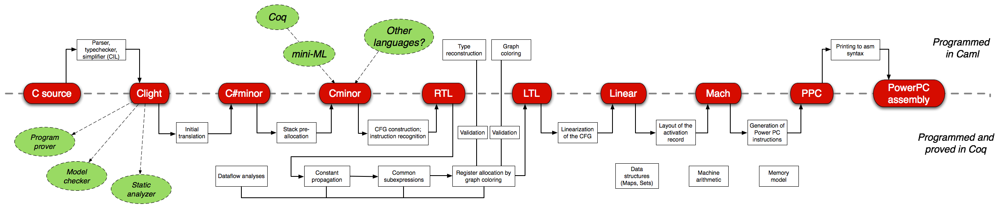
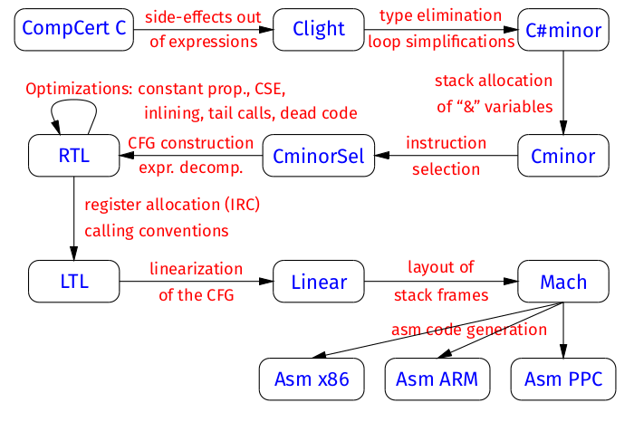
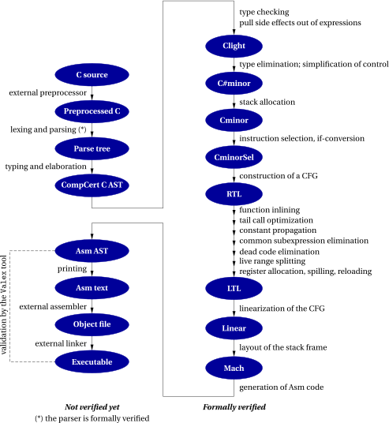

# Lean C Compiler (LCC)

Cloning CompCert
```sh
git clone --filter=tree:0 git@github.com:AbsInt/CompCert.git
```

## CompCert



### [Architecture of the compiler](https://compcert.org/compcert-C.html#archi)

#### Part 1: Parsing, type-checking, and pre-simplifications.

This first part converts C source code into abstract syntax trees of the CompCert C language. Some constructs not natively supported by CompCert C are expanded away. For example, block-scoped local variables are renamed and lifted to function-local scope; and unstructured switch statements are rewritten to structured switch statements with goto statements. Some other unsupported constructs, such as variable-length arrays, are rejected.

This part of CompCert (transformation of C source text to CompCert C abstract syntax trees) is not formally verified. However, CompCert C is a subset of C, and the compiler can output the generated CompCert C code in C concrete syntax (flag -dc), therefore the result of this transformation can be manually inspected. Moreover, most static analysis and program verification tools for C operate on a simplified C language similar to CompCert C. By conducting the analysis or the program verification directly on the CompCert C form, bugs potentially introduced by this first part of the compiler can be detected.

#### Part 2: Compilation of CompCert C AST to assembly AST.

This part is the bulk of the compiler and the one that is proved correct in Coq. It is structured in 16 passes and uses 10 intermediate language, as depicted on the following diagram.


All intermediate languages are given formal semantics, and each of the transformation passes is proved to preserve semantics.

#### Part 3: Assembling and linking.

The abstract syntax tree for PowerPC or ARM or RISC-V or x86 assembly language produced by part 2 is printed in concrete assembly syntax. The system's assembler and linker are then called to produce object files and executable files, respectively. This part is not yet formally verified. A benefit of using the standard assembler and linker is that object files produced by CompCert can be linked with existing libraries compiled with gcc. This is convenient for testing, although the formal guarantees of semantic preservation apply only to whole programs that have been compiled as a whole by CompCert C.

### [Structure of the CompCert C compiler](https://compcert.org/man/manual001.html#sec4)


The general structure of the CompCert C compiler is depicted in Figure 1.1. The compilation of a C source file can be conceptually decomposed into the following phases:
1. Preprocessing: file inclusion, macro expansion, conditional compilation, etc. Currently performed by invoking an external C preprocessor (not part of the CompCert distribution), which produces preprocessed C source code.
2. Parsing, type-checking, elaboration, and construction of a CompCert C abstract syntax tree (AST) annotated by types. In this phase, some simplifications to the original C text are performed to better fit the CompCert C language. Some are mere cleanups, such as collapsing multiple declarations of the same variable. Others are source-to-source transformations, such as pulling block-local static variables to global scope, renaming them if needed to keep names unique. (CompCert C has no notion of local static variable.) Some of these source-to-source transformations are optional and controlled by command-line options (see section 3.2.9).
3. Verified compilation proper. From the CompCert C AST, the compiler produces an Asm code, going through 8 intermediate languages and 15 compilation passes. Asm is a language of abstract syntax for assembly language; it exists in five different versions, one each for PowerPC, ARM 32 bits, AArch64 (ARM 64 bits), x86, and RISC-V. The 8 intermediate languages bridge the semantic gap between C and assembly, progressively exposing an increasing machine-like view of the program. Each of the 15 passes performs either translation to a lower-level language (re-expressing high level construct into lower-level constructs), or optimizations (rewriting the code so as to improve its performance), or both at the same time. (For more details on the passes and the intermediate languages, see Leroy [7, 8].)
4. Production of textual assembly code, followed by assembling and linking. The latter two passes are performed by an external assembler and an external linker, not part of the CompCert distribution.

As shown in Figure 1.1, only phase 3 (from CompCert C AST to Asm AST) and the parser in phase 2 are formalized and proved correct in Coq. One reason is that some of the other phases lack a mathematical specification, making it impossible to state, let alone prove, a correctness theorem about them. This is typically the case for the preprocessing phase 1. Another reason is that the CompCert effort is still ongoing, and priority was given to the formal verification of the delicate compilation passes, especially of optimizations, which are all part of the verified phase 3. Future evolutions of CompCert will move more of phase 2 (unverified simplifications) into the verified phase 3. For phase 4 (assembly and linking), we have no formal guarantees yet, but the Valex tool, available from AbsInt, provides additional assurance via a posteriori validation of the executable produced by the external assembler and linker.

The main optimizations performed by CompCert are:

- Register allocation using graph coloring and iterated register coalescing, to keep local variables and temporaries in processor registers as much as possible.
- Instruction selection, to take advantage of combined instructions provided by the target architecture (such as “rotate and mask” on PowerPC, or the rich addressing modes of x86).
- Constant propagation, to pre-evaluate constant computations at compile time.
- Common subexpression elimination, to avoid redundant recomputations and reuse previously-computed results instead.
- Dead code elimination, to remove useless arithmetic operations and memory loads and stores.
- Function inlining, to avoid function call overhead for functions declared inline.
- Tail call elimination, to implement tail recursion in constant stack space.
- If-conversion, to replace conditional branches by conditional move instructions.

Loop optimizations are not performed yet.
